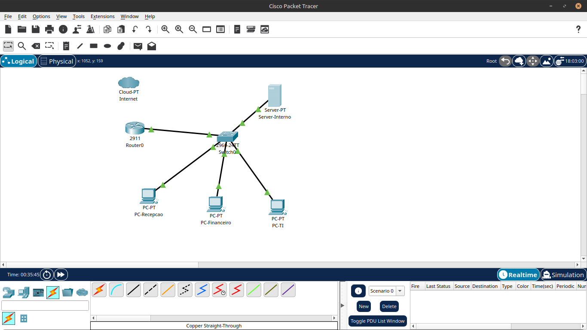
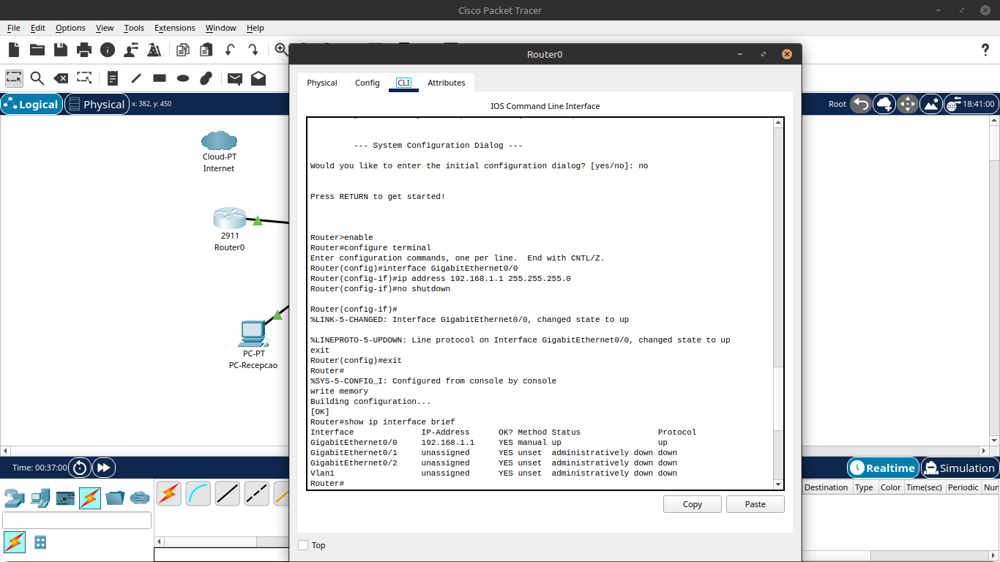
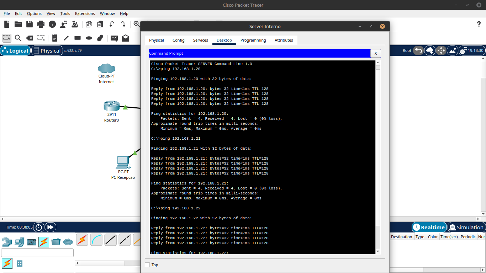

# Fase 1 — Rede Básica de Escritório

### Contexto

Estou na primeira semana na empresa. O gerente pediu para eu mapear e montar a rede do escritório, porque a documentação antiga se perdeu.
A rede precisava ter: acesso à internet via roteador, um switch central conectando todas as máquinas, os computadores dos funcionários
e um servidor interno.

Parece simples isso, mas é exatamente o tipo de tarefa que cai no colo de um analista ou suporte júnior logo no começo.

---

### Topologia

```
[Cloud-PT / Internet]
         |
     [Router 2911]          → Roteador de borda, gateway da rede
         |
     [Switch 2960]          → Switch de camada 2, conecta todos os dispositivos
    /     |      \     \
[PC-   [PC-    [PC-  [Server-
Recepcao] Financeiro] TI]  Interno]
```

**Prints da topologia montada no Packet Tracer:**



---

### Equipamentos utilizados

| Dispositivo | Modelo | Função |
|-------------|--------|--------|
| Roteador | Cisco 2911 | Gateway da rede, conexão com internet |
| Switch | Cisco 2960 | Comutação local, conecta todos os dispositivos |
| PC-Recepcao | PC genérico | Estação de trabalho — Recepção |
| PC-Financeiro | PC genérico | Estação de trabalho — Financeiro |
| PC-TI | PC genérico | Estação de trabalho — TI |
| Server-Interno | Server genérico | Servidor de arquivos interno |
| Cloud-PT | Nuvem PT | Representa a internet/ISP |

---

### Plano de Endereçamento IP

Esse documento é o que em empresas reais chamam de "plano de endereçamento" ou "mapa de rede". Todo analista de infraestrutura deveria ter isso atualizado e acessível.

| Dispositivo | Interface | Endereço IP | Máscara de Sub-rede | Gateway Padrão |
|-------------|-----------|-------------|----------------------|----------------|
| Roteador-Central | GigabitEthernet0/0 | 192.168.1.1 | 255.255.255.0 | — |
| Server-Interno | FastEthernet0 | 192.168.1.10 | 255.255.255.0 | 192.168.1.1 |
| PC-Recepcao | FastEthernet0 | 192.168.1.20 | 255.255.255.0 | 192.168.1.1 |
| PC-Financeiro | FastEthernet0 | 192.168.1.21 | 255.255.255.0 | 192.168.1.1 |
| PC-TI | FastEthernet0 | 192.168.1.22 | 255.255.255.0 | 192.168.1.1 |

**Por que essa faixa de IP?**
A faixa `192.168.x.x` é uma faixa de endereços IP privados (definida pela RFC 1918), usada em redes internas. Nenhum pacote com esse 
endereço sai para a internet diretamente — o roteador faz a tradução via NAT. O endereço `.1` foi reservado para o roteador central (gateway), 
o `.10` para o servidor (servidores é recomendável possuir IPs fixos) e os demais para as estações de trabalho.

---

### Configuração do Roteador

A configuração do roteador foi feita via **CLI (Linha de comando)**, que é a forma padrão de configurar equipamentos Cisco em ambiente 
corporativo.

```bash
enable
configure terminal
interface GigabitEthernet0/0
ip address 192.168.1.1 255.255.255.0
no shutdown
exit
exit
write memory
```

**Explicação de cada comando:**

- `enable` — entra no modo privilegiado (equivalente a virar root/administrador)
- `configure terminal` — entra no modo de configuração global
- `interface GigabitEthernet0/0` — seleciona a interface conectada ao switch
- `ip address 192.168.1.1 255.255.255.0` — atribui o IP e a máscara à interface
- `no shutdown` — liga a interface (por padrão, interfaces de roteadores Cisco vêm desligadas)
- `exit` / `exit` — sai dos modos de configuração
- `write memory` — salva a configuração na memória não volátil (NVRAM)

> **Detalhe importante:** o `no shutdown` é um dos comandos mais esquecidos por quem está começando. Se você configurar o IP mas
> não executar esse comando, a interface fica down e nada funciona. Em troubleshooting, a primeira coisa que verifico é se a interface
> está up/up.

**Verificação com `show ip interface brief`:**

```
Interface           IP-Address    OK? Method Status   Protocol
GigabitEthernet0/0  192.168.1.1  YES manual up       up
GigabitEthernet0/1  unassigned   YES unset  administratively down  down
GigabitEthernet0/2  unassigned   YES unset  administratively down  down
```

A coluna `Status` mostra o estado físico (cabo conectado) e a coluna `Protocol` mostra o estado lógico. Os dois precisam estar `up` 
para a interface funcionar.

**Screenshot da CLI com os comandos e o `show ip interface brief`:**



---

### Testes de Conectividade

Com a rede montada e configurada, o que vou fazer agora é validar se tudo está funcionando. Em suporte, isso é o básico: antes de qualquer 
diagnóstico complexo, você faz um ping.

**Testes realizados a partir do Server-Interno:**

```
C:\>ping 192.168.1.20   → PC-Recepcao
C:\>ping 192.168.1.21   → PC-Financeiro
C:\>ping 192.168.1.22   → PC-TI
```

**Resultado:** 4 pacotes enviados, 4 recebidos, 0% de perda nos três testes.

**Screenshot dos pings realizados:**



---

### O que essa fase representa no mundo real

| Tarefa executada | Equivalente no dia a dia da empresa |
|------------------|--------------------------------------|
| Montar a topologia | Documentar a infraestrutura existente ou montar uma nova |
| Criar o plano de endereçamento | Manter documentação de rede atualizada |
| Configurar roteador via CLI | Colocar equipamento de borda em operação |
| IPs fixos no servidor | Serviços dependem de endereço fixo — DHCP não serve para servidor |
| Teste de ping | Diagnóstico básico de conectividade — feito todo dia em suporte N1 |
| `show ip interface brief` | Comando padrão para verificar status de interfaces |

---

### Arquivo do Projeto

Deixei o arquivo `.pkt` do Packet Tracer com essa topologia disponível na pasta `arquivos/` deste repositório, para caso queiram testar.

---
